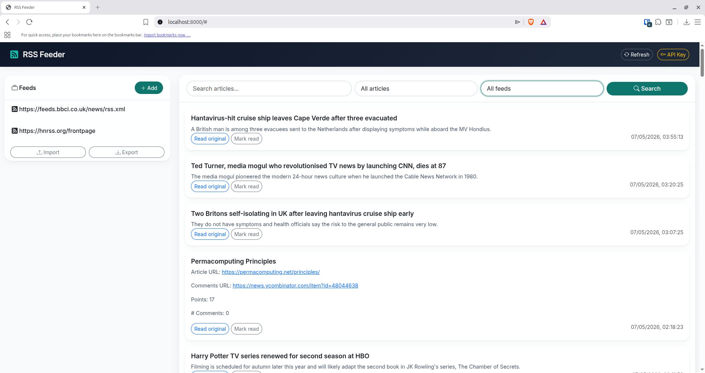

# RSS Aggregator

A self‑contained RSS feed reader built with FastAPI, SQLite, and a modern Bootstrap frontend. Features asynchronous feed refresh, OPML import/export, API key authentication, and rate limiting. Runs inside Docker with named volumes for persistent data and logs.


## Badges

[](https://opensource.org/licenses/MIT)


## Screenshot



The interface shows a left sidebar with feeds, an article grid, search/filter controls, and OPML import/export.

## Quick start

1. Clone the repository:

```bash
git clone https://github.com/luqmarthinus/rss-aggregator.git
cd rss-aggregator
```

2. Copy the environment file and generate a strong API key:

```bash
cp .env.example .env
# Generate a secure 64‑character hex API key
echo "API_KEY=$(openssl rand -hex 32)" >> .env
```
3. Start the stack with Docker Compose:

  ```bash
docker compose up --build -d
```

4. Access the app:


| Service | URL | Description |
|------------|---------|-----------|
| Web frontend   | http://localhost:8000 | Modern feed reader interface |
| Swagger UI (API) | http://localhost:8000/docs | Interactive API documentation |
| OpenAPI spec      | http://localhost:8000/openapi.json | Machine‑readable API description |


5. On the web interface, click the `API Key` button and paste the API_KEY from your `.env` file. Then add feeds like https://hnrss.org/newest, https://feeds.bbci.co.uk/news/rss.xml or whatever you like. Press `Refresh` to fetch articles.

---

## What's included
| Component | Description | Host port |
|------------|---------|-----------|
| FastAPI backend   | RSS fetching, OPML, API key auth, rate limiting, background refresh | 8000 |
| SQLite database | Stores feeds and articles (named volume: `data_volume`) | none |
| Frontend      | Vanilla JS + Bootstrap 5, Bootstrap Icons, DOMPurify for safe HTML | same as app (8000) |

All services are defined in `compose.yaml`. The FastAPI container serves the frontend from `/static` and exposes the versioned API under `/v1` while keeping the original (unversioned) endpoints for backward compatibility. SQLite data and logs are stored in Docker named volumes (`data_volume, logs_volume`).

---

## Endpoints (versioned under `/v1` – also available without prefix)

| Method | Endpoint | Auth required | Description |
|---|---|---|---|
| GET | `/feeds` or `/v1/feeds` | No | List all feeds (id, url, title) |
| POST | `/feeds` or `/v1/feeds` | API key | Add a new RSS/Atom feed |
| DELETE | `/feeds/{id}` or `/v1/feeds/{id}` | API key | Delete a feed and all its articles (CASCADE) |
| GET | `/articles` or `/v1/articles` | No | List articles (paginated, filters) |
| PUT | `/articles/{id}/read` or `/v1/articles/{id}/read` | API key | Mark article as read/unread |
| POST | `/refresh` or `/v1/refresh` | API key | Manually trigger a background refresh |
| GET | `/stats` or `/v1/stats` | No | Get feed / article / unread counts |
| GET | `/feeds/export.opml` | No | Download all feeds as OPML file |
| POST | `/feeds/import.opml` | API key | Upload an OPML file to add multiple feeds |
| GET | `/health` | No | Container liveness/readiness check |

All endpoints are documented in Swagger UI with request/response examples. The unversioned endpoints are aliases of the /v1 routes and are kept for compatibility with the frontend and existing clients.

---

## Frontend integration

The static frontend communicates with the API using `fetch()` and requires an API key for write operations (`POST, PUT, DELETE`). The key is stored in sessionStorage for the duration of the browser session.

Base URL: http://localhost:8000

Authentication header (write operations only):

```bash
X-API-Key: your-api-key-from-env
```
Read operations (`GET`) do not require authentication.

Example feed addition using curl:

```bash
curl -X POST http://localhost:8000/feeds \
  -H "X-API-Key: your-api-key" \
  -H "Content-Type: application/json" \
  -d '{"url":"https://hnrss.org/newest"}'
```
To build your own frontend or client, refer to the OpenAPI spec at `/openapi.json`. The included frontend (`static/js/app.js`) is a complete reference.

---

## Health checks
The FastAPI container defines a healthcheck that polls `/health` every 30 seconds.The container is marked healthy only when the API responds with 200 OK.


## Environment variables

| Variable   | Description                       | Default                                                                 |
|----------|--------------------------------| -----------------------------------------------------------------------------|
| `API_KEY`     | Required. 64‑character hex key for write operations. Generate with openssl rand -hex 32        | Not set |
| `DATABASE_PATH`     | Path inside the container where SQLite stores `aggregator.db`  | `/app/data/aggregator.db`  |
| `REFRESH_INTERVAL_MINUTES`      | How often the background refresh runs (minutes)     | `30`|
| `RATE_LIMIT_PER_MINUTE`     | Maximum number of write requests per IP per minute | `10` |

These variables are set in `.env`. After changing them, restart the container:

```bash
docker compose down
docker compose up -d
```
---

## Stopping the stack

```bash
docker compose down
```
Add `-v` to also remove data (feeds, articles, logs).

---

## Backups
Back up the SQLite database (stored in the named volume `data_volume`) using the provided script:

```bash
# Create a backup in ./backups/
./backup_restore.sh backup

# Restore from a backup file (container will restart)
./backup_restore.sh restore ./backups/aggregator_20260507_062857.db
```

The script stops the container during restore to ensure consistency. For scheduled backups, add a cron job that runs the backup command.

---

## Troubleshooting
Containers restarting/healthcheck failing – Check logs:
```bash
docker compose logs rss-aggregator
```

Permission denied/attempt to write a readonly database – The database file ownership inside the named volume may have changed after a restore. Fix with:

```bash
docker compose exec --user root rss-aggregator chown app:app /app/data/aggregator.db
docker compose restart
```
Feeds not fetching any articles – Verify the feed URL works in a browser. Some feeds block the default User‑Agent; the app sends `RSS-Aggregator/1.0`. Check logs for detailed errors during the refresh cycle.

API returns `405` Method Not Allowed – The frontend or client may be using a trailing slash. The API endpoints are defined without trailing slashes. Use exact URLs as shown in the Swagger docs.

No articles appear after adding a feed – Click the Refresh button or call `POST /refresh`. The background refresh runs every `REFRESH_INTERVAL_MINUTES`. New articles are fetched only if the feed has updated since the last fetch.

OPML import fails with “Invalid OPML file” – The backend automatically escapes unescaped ampersands (`&`), but the XML must otherwise be well‑formed. Validate your OPML with `xmllint --noout file.opml`.

Port 8000 already in use – Change the host port in `compose.yaml` (e.g., "8001:8000") and update the frontend URL accordingly.

## License
MIT. See `LICENSE`.
